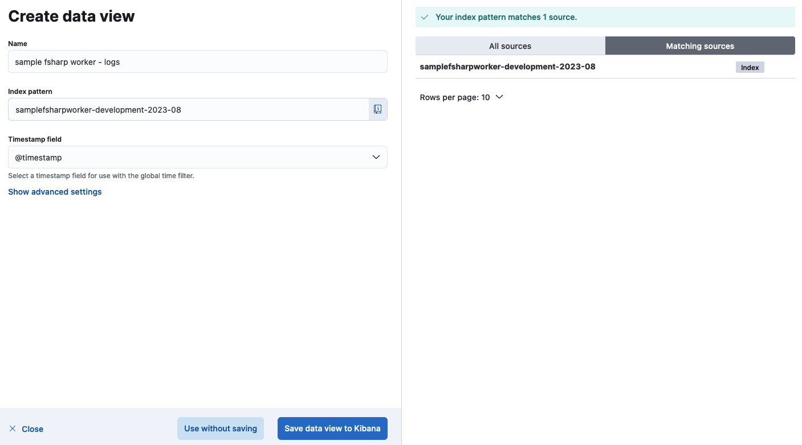
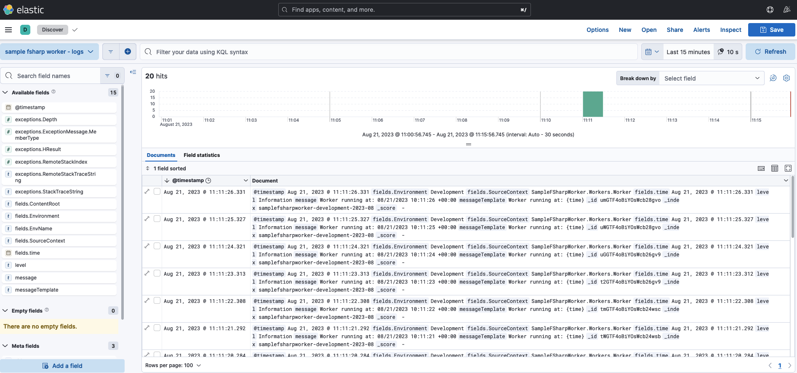

# special-octo-fiesta

A simplified, batteries included, local logging setup of:

* f# worker service
* elasticsearch
* kibana
* docker compose

This should help you configure propagation of logs for the elk stack (logstash excluded). The setup does not include more advanced log shipping elk mechanisms like logstash/filebeat.

This repository started as an attempt to configure otel logs with the elk stack, but the setup is was complex that I realised there could be value in skipping otel for now and demonstrating how simple the configuration could be if we only use the serilog-to-elasticsearch sink. This is by no means production grade setup, but it shows concisely how to set logging up. You can experiment furtner by building on top of this code.

## features

### logs

#### console

```bash
hello logging
[10:11:10 INF] Application started. Press Ctrl+C to shut down.
[10:11:10 INF] Worker running at: 08/21/2023 10:11:10 +00:00
[10:11:10 INF] Hosting environment: Production
[10:11:10 INF] Content root path: /tmp/sample-worker
[10:11:11 INF] Worker running at: 08/21/2023 10:11:11 +00:00
[10:11:12 INF] Worker running at: 08/21/2023 10:11:12 +00:00
[10:11:13 INF] Worker running at: 08/21/2023 10:11:13 +00:00
```

#### kibana

```json
{
  "@timestamp": [
    "2023-08-21T10:11:26.331Z"
  ],
  "fields.Environment": [
    "Development"
  ],
  "fields.Environment.raw": [
    "Development"
  ],
  "fields.SourceContext": [
    "SampleFSharpWorker.Workers.Worker"
  ],
  "fields.SourceContext.raw": [
    "SampleFSharpWorker.Workers.Worker"
  ],
  "fields.time": [
    "2023-08-21T10:11:26.331Z"
  ],
  "level": [
    "Information"
  ],
  "level.raw": [
    "Information"
  ],
  "message": [
    "Worker running at: 08/21/2023 10:11:26 +00:00"
  ],
  "messageTemplate": [
    "Worker running at: {time}"
  ],
  "messageTemplate.raw": [
    "Worker running at: {time}"
  ],
  "_id": "umGTF4oBiYOsWcb28gvo",
  "_index": "samplefsharpworker-development-2023-08",
  "_score": null
}
```

## how to use

* `./start-development-environment.sh`
* `./stop-development-environment.sh`
* `./build.sh`
* `./run.sh`
* `./nuke-development-environment.sh`

### kibana

* http://localhost:5601/app/discover#/?_g=()
* main menu -> analytics -> discover
* create data view
  * index name
  * index pattern
  * timestamp field
  * save data view to kibana

  
* main menu -> analytics -> discover
  * browse your logs

  

## resources used

* https://opentelemetry.io/docs/instrumentation/net/getting-started/
* https://learn.microsoft.com/en-us/dotnet/core/diagnostics/observability-with-otel
* https://github.com/open-telemetry/opentelemetry-dotnet-contrib/blob/main/examples/runtime-instrumentation/Program.cs
* https://github.com/open-telemetry/opentelemetry-dotnet/blob/main/docs/logs/getting-started/README.md
* https://www.twilio.com/blog/build-a-logs-pipeline-in-dotnet-with-opentelemetry
* https://www.elastic.co/guide/en/enterprise-search/current/logging-view-query-logs.html
* https://github.com/ty-elastic/otel-logging - it's for java, but still useable
* https://github.com/open-telemetry/opentelemetry-dotnet/blob/main/src/OpenTelemetry.Exporter.OpenTelemetryProtocol/README.md - logs are TODO :D
* https://learn.microsoft.com/en-us/dotnet/core/extensions/logging-providers
* https://www.youtube.com/watch?v=0acSdHJfk64
* https://www.elastic.co/blog/getting-started-with-the-elastic-stack-and-docker-compose
* https://github.com/elastic/ecs-dotnet/blob/main/examples/console-with-extensions-logging/docker-compose.yml
* https://www.youtube.com/watch?v=zp6A5QCW_II
* https://www.elastic.co/blog/3-models-logging-opentelemetry-elastic
  * good presentation material
  * opentelemetry includes provisions for span events
  * elastic common schema - but that does not apply to logs collected via otlp instrumentation. In that case, logs remain formatted in otel log semantics. But ECS is to become the standard for log semantics [2023-04-18 article](https://www.elastic.co/blog/ecs-elastic-common-schema-otel-opentelemetry-announcement)
  * Conversion to ECS happens within Elastic keeping log data vendor-agnostic until ingestion
* https://opentelemetry.io/docs/instrumentation/#status-and-releases - opentelemetry instrumentation library seems to be stable, especially for dotnet